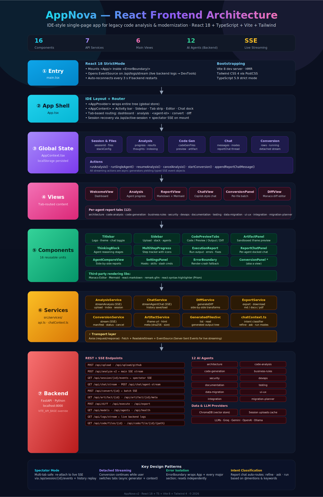

<div align="center">

# 🚀 AppNova — Code Modernization Studio

> **Turn any legacy codebase into a runnable, demoable target stack — line-by-line, 1-to-1, with a full audit trail.**
> Drive Claude Code headless through a DAG of specialist agents, get back architecture diagrams, security audits, a file-by-file migration blueprint, an actually-runnable converted project, and `.md` + `.docx` + `.pdf` reports — all on your **Claude Max subscription** (zero API spend for analysis runs).

[](https://www.python.org/)
[](https://fastapi.tiangolo.com/)
[](https://www.uvicorn.org/)
[](https://docs.claude.com/en/docs/claude-code/overview)
[](https://playwright.dev/)
[](https://mermaid.js.org/)
[](LICENSE)
[](#prerequisites)

</div>

---

## Frontend Architecture at a Glance



> Full interactive version: [AppNova_Frontend_Architecture.html](AppNova_Frontend_Architecture.html) - Raw SVG: [AppNova_Frontend_Architecture.svg](AppNova_Frontend_Architecture.svg)

---

## ✨ What is AppNova?

AppNova is a self-hosted modernization studio that ingests a legacy codebase and delivers a complete, demoable migration package:

- 💬 **Per-agent chat drawer** on every report card — ask follow-ups, request edits, or flip into **Fix code** mode and let Claude edit the converted project in place. Every code-mode turn snapshots `converted/` first so any edit is reversible.
- 🧠 **13 specialist agents** — code-analysis, architecture, security, business-rules, integration, data-migration, devops, migration-planner, code-generation, documentation, code-review, testing, ui-ux. (`discovery` is a Wave 0 pre-step, not a registry agent.)
- 📚 **Playbook + RAG layer** — every supported stack (Laravel → .NET, AngularJS → React, React-class → React-TS) ships a `PlaybookDefinition` ([backend/playbooks/](backend/playbooks/)) with idiomatic-translation hints, type-mapping tables, parity floors, and per-agent prompts. The optional **ChromaDB RAG** layer ([backend/playbooks/rag/](backend/playbooks/rag/)) retrieves hand-authored gold examples + verified prior conversions + sibling files from the same upload, and splices them into `code-generation` and `migration-planner` prompts as a `RETRIEVED EXAMPLES` block. Source ingestion is per-session (no cross-tenant leakage), result ingestion is gated by parity ≥ floor + supervisor-ok. Disable any time with `APPNOVA_RAG_ENABLED=0`.
- 🪵 **Live logs drawer** in the top bar — backend log tail, per-agent stream logs (success + error), HTTP request/response previews, color-coded errors. 3 s auto-refresh, surfaces what is actually broken without ssh-ing into the host.
- 🛡️ **Production-ready placeholder hardening** — deploy-details form (14 fields: app names, DB server / name / admin, Azure hosting model / region, VM OS / web-server / admin / deploy-root, public FQDN, backend / frontend ports); the underlying `context/deploy_config.json` schema carries 10 more keys (Azure AD GUIDs, Key Vault refs, SMTP, SSO domains) that are not yet exposed in the form and must be hand-edited in the JSON for now. Plus a regex-based leak detector, **automatic quarantine pass** that rewrites any leaked literal to a `__FIELDNAME__` placeholder + ships a deterministic `docs/SECRETS_MAPPING.md` with the exact `az keyvault secret set` / `dotnet user-secrets set` commands. No more `BeagleVM` / `aries_db_dev` / real GUIDs in the converted output.
- 🗺️ **Server-side mermaid prerender** — every `` ```mermaid `` block is rendered to SVG/PNG by a Playwright/Chromium pass before the report is saved. Same pixel output in the browser, the PDF export, and the DOCX. No more silent "Syntax error in text" PDF bombs.
- 🔄 **`file_map.json` contract** — `migration-planner` ships an authoritative source→target file map; `code-generation`, `code-review`, `testing`, and the deterministic auditors (`file_coverage`, `parity_checker`, `round_trip_tester`, `deploy_audit`) all read it. If the planner ships without one, the supervisor auto-dispatches a **repair pass** with a `<REPAIR PASS>` preamble. If the canonical `file_map.json` is missing at read time but the planner's markdown report is on disk (e.g. an interrupted repair/multipass dropped the promote step), the file-map reader **recovers the map from the markdown** (`migration-planner_attempt1.md` / `upstream_migration-planner.md`) before falling back to the disk-walk synthesizer — a valid planner map always beats a stem-matched guess. The Migration Map UI distinguishes **REWRITE / CREATE / DELETE / UNMAPPED** (a target-less, non-skipped row is `UNMAPPED`, *not* `DELETE`).
- 🧮 **Eval harness** — `python -m backend.evals {score|score-all|diff}` produces a CSV scorecard of every session's coverage / leak / cost / elapsed numbers and diffs two runs side-by-side. Zero LLM cost; great for prompt-edit regression detection.
- ⏱️ **Topbar run-elapsed timer** survives hub→workspace navigation (server-side stamped, frontend rehydrates from `/api/session/<sid>/status`).
- 📦 **Auto-export** writes every finished report to [exports/](exports) as `.md`, `.docx`, **and** `.pdf` the moment it completes.
- 🧊 **Demo sessions** freeze a completed run (reports + exports + converted project) into [demo_sessions/](demo_sessions) so you can replay a known-good analysis instantly without burning new Claude tokens.
- 💵 **Cost tracker** persists per-agent token counts to a 5-sheet Excel workbook — see exactly what each agent cost for a run.
- 🎛️ **Director mode** (`APPNOVA_DIRECTOR_MODE=1`) lets Claude itself decide which sub-agents to spawn instead of running the fixed DAG — useful for open-ended codebases.
- 🔒 **100% local code** — your source never leaves your machine; only prompts go to Anthropic.
- 🛡️ **Governance layer** ([backend/governance/](backend/governance/)) — upload-time **input sanitizer** (blocked extensions, path-traversal, prompt-injection detection), per-agent **output scrubber** (PII + secret redaction before reports are saved), and an **append-only audit log** (`logs/audit.jsonl`) recording auth, upload, and every agent lifecycle event. All three passes are individually togglable via env vars and configurable via `backend/governance/policies/default_policy.yaml`.

---

## 📐 Architecture at a Glance

```text
┌───────────────────────────────────────────────────────────────────────────┐
│   Browser  (frontend/)  —  static HTML/JS, no build step                  │
│   • Cards per agent  • Chat drawer  • Export panel  • Demo list           │
└──────────────────────────┬────────────────────────────────────────────────┘
                           │ REST + SSE  (login.html → JWT → /api/*)
┌──────────────────────────▼────────────────────────────────────────────────┐
│   FastAPI backend  (backend/main.py — :8002)                              │
│                                                                           │
│   /api/upload                  multipart / zip → uploads/{sid}/source/    │
│   /api/analyze/{sid}           SSE — wave/agent events                    │
│   /api/chat/{sid}/{aid}        per-card chat (report or code mode)        │
│   /api/mermaid/render          server-side SVG cache                      │
│   /api/export/{sid}/{aid}.*    .docx / .pdf re-download                   │
│   /api/demo-sessions/*         freeze · load · list · delete              │
│                                                                           │
│                  ┌────────────────────────────────────┐                   │
│                  │ Supervisor  (agents/supervisor.py) │                   │
│                  │ DAG → topological waves            │                   │
│                  └────────────────────────────────────┘                   │
│                                  │                                        │
│   Wave 0:  discovery                                                      │
│   Wave 1:  code-analysis · architecture · security · integration          │
│            business-rules · data-migration · devops                       │
│   Wave 2:  migration-planner             ← writes file_map.json           │
│   Wave 3:  code-generation               ← writes converted/              │
│            (multipass DEFAULT-ON: chunks file_map by 50-row slices        │
│             with cooldown between — APPNOVA_CODEGEN_CHUNK_SIZE)           │
│   Wave 3b: documentation                 ← writes converted/docs/         │
│   Wave 4:  code-review · testing · ui-ux                                  │
│   Wave 5:  migration_pipeline (deterministic, post-agent)                 │
│            • field_extractor → augment → emit                             │
│            • parity_checker → FIELD_PARITY.md/.json                       │
│            • round_trip_tester (plan or live, auto-upgrades to live       │
│              when run_manager reports a live converted backend +          │
│              APPNOVA_ROUND_TRIP_AUTOSTART=true)                           │
│            • rag-learn — gated write of verified rows into                │
│              {playbook}__learned (parity ≥ floor + supervisor_ok)         │
│                                                                           │
│                  ┌────────────────────────────────────┐                   │
│                  │ Runner  (agents/runner.py)         │                   │
│                  │ asyncio.create_subprocess_exec     │                   │
│                  │   "claude" "-p" <prompt>           │                   │
│                  │   --output-format stream-json      │                   │
│                  └────────────────────────────────────┘                   │
└──────────────────────────┬────────────────────────────────────────────────┘
                           ▼
┌───────────────────────────────────────────────────────────────────────────┐
│   Claude Code CLI  →  Anthropic servers  →  streamed tool calls           │
│   • Read / Glob / Grep on cwd=uploads/{sid}/source/                       │
│   • Write / Edit on cwd=uploads/{sid}/converted/  (writer-agents only)    │
│   • Per-cwd lock serialises code-generation · code-review · testing · ui  │
└───────────────────────────────────────────────────────────────────────────┘
                           ▲
┌──────────────────────────┴────────────────────────────────────────────────┐
│   Post-processing pipeline                                                │
│   • Mermaid pre-render  (Playwright Chromium → SVG cache by sha256)       │
│   • diagram_qa repair   (auto-fix syntax bombs before export)             │
│   • file_coverage       source→target mapping audit (fail < 70%)          │
│   • deploy_audit        literal + regex leak scan over converted/         │
│   • quarantine_leaks    rewrite leaks to __FIELDNAME__ placeholders       │
│                          (gated by APPNOVA_QUARANTINE_LEAKS=true)         │
│   • render_secrets_mapping  → docs/SECRETS_MAPPING.md                     │
│   • export.py           md → html → docx (python-docx) / pdf (Chromium)   │
│   • cost_tracker        per-agent token ledger → 5-sheet .xlsx            │
└───────────────────────────────────────────────────────────────────────────┘
```

### Notable design choices

| Decision | Why it matters |
|---|---|
| **Parallel waves over a hardcoded 12-step loop.** Agents declare `upstream` deps; [`compute_waves()`](backend/agents/supervisor.py) topologically layers them. | Wave size is whatever the DAG allows. Independent agents run concurrently; dependent ones wait. |
| **Blackboard state.** Completed agents write markdown to [`RunState`](backend/agents/state.py); later waves read via file paths, not in-memory passing. | Crash-resumable. A dropped wave can be re-run from where it died. |
| **Writer-agent lock.** `code-generation`, `code-review`, `testing`, `ui-ux` all write into `converted/` and serialise on a per-cwd lock. | Concurrent writers can't trample shared files. |
| **`file_map.json` is enforced.** If `migration-planner` ships without a parseable `## A.4 file_map.json` block, the supervisor saves the draft and dispatches a repair pass. | Downstream `code-generation` + `code-review` read `context/file_map.json` as their authoritative contract. |
| **Chat snapshots.** "Fix code" mode copies `converted/` (minus `node_modules`, `.venv`, `.git`, `dist`, `build`, `__pycache__`, `.next`, …) to `chat/{agent}/snapshots/snap-xxxx/` before Claude edits anything. | Any turn is reversible by restoring the snapshot folder. |
| **`required_upstream`** hard-skips agents whose contract upstream errored (e.g. `code-generation` skips loudly if `migration-planner` failed). | Surfaces the real blocker instead of silently producing a half-broken converted/ tree. |
| **Playbook resolves once per run.** `resolve_playbook(upload_dir)` at the top of `run_supervised` picks the best-matching `PlaybookDefinition` by scoring `source_signals` against the file tree. Threaded through every agent prompt via `playbook=` so all agents see the same idiomatic-translation rules. | Per-agent hint registration in [`backend/playbooks/registry.py`](backend/playbooks/registry.py) used to be dead code; threading the playbook is what made the hints actually fire. Stylesheet signals (`*.scss / *.sass / *.less / *.css`) added 2026-05-15 to stop the planner from silently dropping every `.scss` file. |
| **RAG is best-effort enrichment, not authority.** `build_agent_prompt` appends a `RETRIEVED EXAMPLES` block when retrieval yields hits, but **deterministic mapping + parity + coverage gates remain authoritative**. The corresponding chunker / embedder / ChromaDB calls all degrade to no-op when `chromadb` is missing or `APPNOVA_RAG_ENABLED=0`. | Retrieval quality should never be a load-bearing dependency. If RAG breaks, the prompt simply doesn't get the extra examples. Pipeline behaviour is identical to pre-RAG when the flag is off. |
| **`__learned` writes are gated.** `migration_pipeline._step_rag_learn` runs after parity + round-trip and only inserts rows where `parity_pct ≥ playbook.rag.learned_parity_floor_pct` and `supervisor_ok=True`. Every row carries `agent_version` so a regressed batch is deletable. | The compounding-corpus loop is the whole reason for `__learned`. Without gates, a single bad batch poisons every future retrieval; the parity floor + `agent_version` are the only things keeping the corpus honest. |
| **Per-session `__source` isolation.** Source ingestion writes to `{playbook}__source__{session_id}` — never to a shared `__source`. `clear_session_source` is the explicit cleanup hook. | Prevents one tenant's uploaded code from leaking into another tenant's retrieval results. Required before this layer can be multi-tenant. |

---

## 🤖 The 13 specialist agents

Every agent is registered in [`backend/core/config.py`](backend/core/config.py) (`AGENT_REGISTRY`). Tiers resolve to a model via `model_for(tier)` — the default pinning is **Claude Sonnet 4.6 across every tier** so demo-freeze replays are byte-for-byte reproducible. Override per-tier with `HEAVY_MODEL` / `LIGHT_MODEL` / `DISCOVERY_MODEL` env vars.

| Agent ID | Tier | Wave | Output |
|---|---|---|---|
| `code-analysis` | heavy | 1 | Module graph, complexity, tech debt, ER diagram |
| `architecture` | heavy | 1 | Layer map, mermaid flowcharts, ADRs |
| `business-rules` | heavy | 1 | Rules catalog, validation matrix, per-workflow state machines |
| `security` | heavy | 1 | OWASP mapping, secrets scan, auth audit |
| `integration` | light | 1 | External API touchpoints, retry/circuit patterns, target-stack bindings |
| `data-migration` | light | 1 | Schema map, target ER diagram, migration SQL/ORM scripts |
| `devops` | light | 1 | Dockerfiles, CI YAML, IaC, monitoring dashboards (reads `deploy_config.json` + canonical templates) |
| `migration-planner` | heavy | 2 | Phases, gantt, risks, gates, **Section A file-by-file blueprint + `file_map.json`** |
| `code-generation` | heavy | 3 | Full target-stack project in `converted/` (requires `migration-planner`; chunked-multipass when `APPNOVA_CODEGEN_MULTIPASS=true`) |
| `documentation` | light | 3 | Real `docs/README.md` / `docs/SETUP.md` / `docs/DEPLOY.md` / `docs/API.md` / `docs/DATA_DICTIONARY.md` written **into the converted tree** (requires `code-generation`) |
| `code-review` | heavy | 4 | Gap + fidelity audit against `file_map.json` (requires `code-generation`) |
| `testing` | light | 4 | Unit + integration + E2E scaffolds in target-stack conventions |
| `ui-ux` | heavy | 4 | Navigation tree flowchart, component polish suggestions |

> Exact wave membership is computed at runtime from the registered DAG — see [`backend/core/config.py`](backend/core/config.py). `devops` and `data-migration` always run; their `signals` glob list is a hint the prompt uses to detect "no explicit signal" projects (Laravel/Django/.NET/classic-Java) and adapt its wording.

### After-the-agents auditors (deterministic, no LLM cost)

The supervisor runs these inline immediately after each affected agent:

| Auditor | When | Effect |
|---|---|---|
| [`file_coverage`](backend/agents/file_coverage.py) | post `code-generation` | Walks source vs `converted/`, computes coverage_pct. Downgrades `code-generation` to status=error when < 70% so downstream agents skip cleanly. |
| [`deploy_audit`](backend/agents/deploy_audit.py) | post `code-generation` | Literal scan (8 known leaks: `BeagleVM`, `aries_db_dev`, …) + 5 regex patterns (Azure AD GUID, secret-token shape, `Server=Password=...`, `User Id=...`, Azure FQDN). Writes `docs/DEPLOY_AUDIT.md`. |
| [`quarantine_leaks`](backend/agents/deploy_audit.py) | when `APPNOVA_QUARANTINE_LEAKS=true` (default on) | Rewrites every leak in place: literal → user-supplied value (when deploy form populated) OR `__FIELDNAME__` placeholder. Adds "Quarantined" + "Placeholders emitted" sections to `DEPLOY_AUDIT.md`. |
| [`render_secrets_mapping`](backend/agents/deploy_audit.py) | always after deploy_audit | Generates `docs/SECRETS_MAPPING.md` with one row per emitted placeholder + `az keyvault secret set` and `dotnet user-secrets set` commands. |
| [`context_attestation` scan](backend/agents/supervisor.py) | post each agent (except `migration-planner`) | Reads first 4 KB of agent report, classifies the `## Context` block as `full` / `partial` / `gap` / `weak` / `missing`. Painted as a chip on each card. |
| [`ui_inventory_shape`](backend/agents/supervisor.py) | post `code-generation` | Validates `ui_source_inventory.md` shape; flags when the LLM emitted a mapping table instead of a per-file inventory. |
| [`enrich_file_map_from_context`](backend/agents/synthesize_file_map.py) | post `migration-planner` wave | Deterministic union of the planner's `file_map.json` with `field_inventory.json` + `source_routes.json` + stylesheet walker. Augmented rows get `_disk_inferred=true` + `_inferred_from=<source>` so reviewers can tell planner-authored rows from auto-augmented ones. Prevents the planner's row count from being a hard ceiling on what downstream agents see (this is why the 2026-04-24 session shipped 12 target pages against a 130-state source). |
| [`write_source_route_manifest`](backend/agents/source_routes.py) | pre-`migration-planner` | Walks the source for every state / path / page declaration (Laravel routes, AngularJS ui-router, React Router, etc.), writes `context/source_routes.json` so the planner has a deterministic baseline before it starts. Re-emitted when missing on a cached re-run. |

---

## 📚 Playbook + RAG layer

Two layers on top of the agent DAG that bias every conversion towards idiomatic, repeatable output. **Playbooks** are always-on, deterministic, and audit-friendly. **RAG** is optional, ChromaDB-backed, and ships dark behind a feature flag.

### Playbook system

A `PlaybookDefinition` ([backend/playbooks/schema.py](backend/playbooks/schema.py)) is six frozen dataclasses — one per design layer:

| Layer | Dataclass | Purpose |
|---|---|---|
| 1 | `PlaybookMapping` | Source ↔ target field/type mapping, synonym pairs, ignored-field regex |
| 2 | `PlaybookTransformation` | `codegen_style`, global `prompt_preamble`, per-agent `agent_hints` |
| 3 | `PlaybookValidation` | `coverage_floor_pct`, `parity_green_floor_pct`, `require_round_trip` |
| 4 | `PlaybookWorkflow` | `skip_agent_ids`, `extra_agent_ids`, `fail_fast`, `round_trip_mode` |
| 5 | `PlaybookFeedback` | Report formats, cost-report toggle, post-step hook IDs |
| 6 | `PlaybookRAG` | RAG kill-switch + retrieval policy (per-playbook) |

The shipped registry ([backend/playbooks/registry.py](backend/playbooks/registry.py)) covers three migration types:

| Playbook ID | Source | Target |
|---|---|---|
| `laravel-to-dotnet` | Laravel PHP + Eloquent + Blade | .NET 8 Minimal API (C# records, EF Core) + React 18 TS |
| `angularjs-to-react` | AngularJS 1.x ($scope / $http / ui-router) | React 18 + TS + Hook Form + Router v6 |
| `react-upgrade` | React class components / vanilla JS | React 18 functional + TS strict |

`resolve_playbook(upload_dir)` scores every registered playbook against the file tree using `fnmatch` against `source_signals` (e.g. `composer.json`, `*.blade.php`, `resources/sass/**`). Best match wins; the explicit `*.scss / *.sass / *.less / *.css` signals are why every stylesheet now lands in the file_map instead of vanishing silently (2026-05-15 fix). Falls back to `GENERIC_PLAYBOOK` on no match.

Playbook context is injected into every agent prompt by `build_agent_prompt(..., playbook=...)` as a `## PLAYBOOK GUIDANCE — <source> → <target>` block placed between the context-files block and `YOUR TASK`. The hints are MANDATORY — they override default behaviour described under `YOUR TASK` for framework idioms (control flow, lifecycle, ORM, templating) but yield to verbatim-preservation rules for domain logic (business rules, validation, edge cases).

### RAG (ChromaDB)

Optional retrieval layer that splices a `## RETRIEVED EXAMPLES` block into the prompts of `code-generation` and `migration-planner`. Three collections per playbook, all in one persistent ChromaDB store under `<repo>/chroma/`:

| Collection | Source | Lifetime | Used as |
|---|---|---|---|
| `{playbook}__curated` | Hand-authored source→target pairs in [backend/playbooks/examples/`<id>`.jsonl](backend/playbooks/examples/) | Permanent, version-controlled | Highest-trust hits — retrieved first |
| `{playbook}__learned` | Auto-stored verified conversions, written by `migration_pipeline._step_rag_learn` after parity/round-trip gates pass | Permanent, gated writes | Medium-trust — retrieved second |
| `{playbook}__source__{session_id}` | Per-symbol chunks of the user's uploaded code, written by the supervisor at the top of a run | Per-session — dropped automatically when the session ends (stop / error / completion); also via `POST /api/rag/clear-session/{sid}` for manual cleanup | Sibling-file context |

Retrieval order is `curated → learned → source`, deduped by `(kind, path, symbol_name)` then sorted by score. `format_hits_for_prompt(...)` renders the block with language-tagged code fences. Prompt-bloat ceiling: `PlaybookRAG.max_context_tokens` × 4 chars.

**Three-tier embedding provider:** OpenAI `text-embedding-3-small` (preferred, requires `OPENAI_API_KEY`) → `sentence-transformers` `BAAI/bge-small-en-v1.5` (local) → hash-based deterministic fallback (plumbing only). The provider AppNova is using is reported by `GET /api/rag/status`.

**Write-gating for `__learned`:** `parity_pct ≥ playbook.rag.learned_parity_floor_pct` AND `supervisor_ok` AND (round-trip passed when `learned_require_round_trip=True`). Every row carries `agent_version` so a regressed batch can be purged via the admin CLI (see below).

**RAG corpus admin CLI** ([backend/playbooks/rag/admin.py](backend/playbooks/rag/admin.py)):

```bash
# Show Chroma collection counts and status
python -m backend.playbooks.rag.admin stats

# List agent_version tags present in __learned (all playbooks or one)
python -m backend.playbooks.rag.admin list-versions
python -m backend.playbooks.rag.admin list-versions --playbook laravel-to-dotnet

# Delete __learned entries by agent_version — purge a regressed batch
python -m backend.playbooks.rag.admin purge --version v2026.05.13
python -m backend.playbooks.rag.admin purge --version v2026.05.13 --playbook laravel-to-dotnet
```

**RAG recall eval harness** ([backend/playbooks/rag/tests/eval.py](backend/playbooks/rag/tests/eval.py)):

```bash
# Recall@3 for one playbook
python -m backend.playbooks.rag.tests.eval \
    --playbook laravel-to-dotnet \
    --queries scripts/rag_eval_queries.jsonl

# A/B comparison: RAG-on vs. no-retrieval baseline — shows lift in percentage points
python -m backend.playbooks.rag.tests.eval \
    --queries scripts/rag_eval_queries.jsonl \
    --ab

# Cross-playbook (all playbooks in the JSONL in one run)
python -m backend.playbooks.rag.tests.eval \
    --queries scripts/rag_eval_queries.jsonl --ab
```

10 reference queries covering all three registered playbooks live in [`scripts/rag_eval_queries.jsonl`](scripts/rag_eval_queries.jsonl). Run `POST /api/rag/seed` once to populate `__curated` before the eval, otherwise recall = 0%.

**Per-symbol chunker** ([backend/playbooks/rag/chunking/chunker.py](backend/playbooks/rag/chunking/chunker.py)): regex-based header detection per language (PHP / Python / JS / TS / TSX / C# / interfaces / records / arrow-fn consts), brace walker that respects string literals, indent walker for Python. Files with no symbol matches (stylesheets, blade, configs, HTML) fall back to whole-file chunks. Skips `node_modules`, `vendor`, `.git`, `__pycache__`, `_appnova_legacy_runtime`.

**Feature-flag matrix:**

| Layer | What turns it off |
|---|---|
| Process-wide | `APPNOVA_RAG_ENABLED=0` (kill switch, default `1`) |
| chromadb missing | Package not installed → every public function gracefully no-ops |
| Per-playbook | `PlaybookRAG.enabled=False` |
| Per-agent | `agent_id not in PlaybookRAG.enabled_agent_ids` |

When any layer is off, `build_agent_prompt` simply omits the `RETRIEVED EXAMPLES` block — prompt byte-for-byte identical to the pre-RAG behaviour.

**Quick start for RAG:**

```bash
# chromadb is in requirements.txt — installed by `pip install -r backend/requirements.txt`
export OPENAI_API_KEY=sk-...                       # optional; without it, falls back to ST or hash
curl -X POST http://localhost:8002/api/rag/seed    # one-time, populates __curated
#   PowerShell:  Invoke-RestMethod -Method Post -Uri http://localhost:8002/api/rag/seed
#   or:          curl.exe -X POST http://localhost:8002/api/rag/seed   (curl.exe bypasses the PS alias)
# To turn it off without uninstalling chromadb:
export APPNOVA_RAG_ENABLED=0
```

See [`PLAYBOOK_RAG_DESIGN.md`](PLAYBOOK_RAG_DESIGN.md) for the long-form design doc and [`changes_15-05-2026.md`](changes_15-05-2026.md) → "RAG implementation — APN-1 through APN-15" for the implementation log.

---

## 🪵 Live logs drawer + observability

Click **📜 Logs** in the top bar to open the side panel. Two tabs:

- **Backend** — tail of [`logs/backend.log`](logs/), auto-refresh every 3 s, color-coded (errors red, warnings amber, `[http]` muted, `[http-error]` red, `[RAG]` highlighted).
- **Agent runs** — inventory of every per-agent stream log under [`logs/agents/`](logs/agents/). Click a row to load its content. Every successful agent now writes a `<timestamp>_<agent_id>_success.log` alongside the existing error logs ([`runner._write_success_log`](backend/agents/runner.py)).

**HTTP capture middleware** in [`backend/main.py`](backend/main.py) logs URL + status for every request and the response payload (truncated to 2 KB) on 4xx / 5xx. This is what makes the network-console preview meaningful — you see the actual error body, not just the status code. All `/api/rag/*` and `/api/logs/*` calls flow through the same middleware.

---

## 🌐 API Surface

All routes live in [`backend/main.py`](backend/main.py). Swagger UI is served at `http://127.0.0.1:8002/docs`.

### 🔐 Auth & system
| Method | Route | Purpose |
|---|---|---|
| GET | `/health` | Liveness probe |
| POST | `/api/auth/login` | Username/password → JWT |
| GET | `/api/auth/me` | Resolve current user from JWT |

### 📁 Projects, upload, sessions
| Method | Route | Purpose |
|---|---|---|
| GET / POST | `/api/projects` | List / create projects (multi-session container) |
| GET / DELETE | `/api/projects/{project_id}` | Fetch / delete project |
| POST | `/api/projects/{project_id}/attach` | Attach an existing session |
| POST | `/api/projects/{project_id}/detach` | Detach a session |
| GET | `/api/projects/{project_id}/notifications` | Per-project event feed |
| POST | `/api/upload` | Multipart upload (zip or folder) → new session — sessions land at `uploads/<slug>-<sid>/` when `project_name` is provided, else `uploads/<sid>/` (legacy) |
| POST | `/api/sessions/{session_id}/upload` | Add files to existing session |
| POST | `/api/session/{session_id}/stack` | Set the target-stack directive |
| **GET / POST** | **`/api/session/{session_id}/deploy-config`** | **Read or write the deployment-details config (the form exposes 14 DB / Azure / VM fields; the JSON schema also accepts 10 Secrets & SSO keys not yet in the form). GET returns `warnings[]` from the pre-flight validator so the UI can paint a yellow banner.** |

### 🚀 Analyze, resume, status
| Method | Route | Purpose |
|---|---|---|
| **POST** | **`/api/analyze/{session_id}`** | **SSE stream of `wave_start` / `agent_start` / `agent_event` / `agent_complete` events** |
| POST | `/api/run-selected/{session_id}` | Run an arbitrary subset of agents |
| POST | `/api/resume/{session_id}` | Resume a partially-completed run |
| GET | `/api/results/{session_id}` | Aggregated agent reports |
| GET | `/api/session/{session_id}/status` | Wave/agent status snapshot |
| GET | `/api/session/{session_id}/discovery-status` | Discovery-only status |
| POST | `/api/stop/{session_id}` | Cancel an in-flight run |

### 💬 Chat
| Method | Route | Purpose |
|---|---|---|
| GET | `/api/chat/{session_id}/{agent_id}/tree` | Conversation tree (branches form a DAG) |
| GET | `/api/chat/{session_id}/{agent_id}/version/{node_id}` | Hydrate a specific branch node |
| POST | `/api/chat/{session_id}/{agent_id}/active` | Mark active branch |
| POST | `/api/chat/{session_id}/{agent_id}` | Append a turn (report mode or **fix-code mode** — snapshots `converted/` first) |

### 🗺️ Mermaid, exports, costs, file map
| Method | Route | Purpose |
|---|---|---|
| POST | `/api/mermaid/render` | Server-side SVG render (sha256-cached) |
| GET | `/api/exports/{session_id}` | List auto-written `.md` / `.docx` / `.pdf` |
| GET | `/api/exports/{session_id}/{filename}` | Download an export |
| GET | `/api/export/{session_id}/{agent_id}.docx` | On-demand DOCX |
| GET | `/api/export/{session_id}/{agent_id}.pdf` | On-demand PDF |
| GET | `/api/cost/{session_id}/summary` | Per-agent token + USD summary |
| GET | `/api/cost/{session_id}/report.xlsx` | 5-sheet cost workbook |
| GET | `/api/sessions/{session_id}/file-map` | Parsed `file_map.json` |
| GET | `/api/artifact/{session_id}` | Inline UI/UX artifact HTML |

### 🧊 Demo sessions
| Method | Route | Purpose |
|---|---|---|
| GET | `/api/demo-sessions` | List frozen demos |
| POST | `/api/demo-sessions/freeze/{session_id}` | Snapshot a completed run |
| GET | `/api/demo-sessions/{slug}` | Demo metadata |
| POST | `/api/demo-sessions/load/{slug}` | Restore a demo to `uploads/` |
| DELETE | `/api/demo-sessions/{slug}` | Delete a frozen demo |

### 🧪 Run / browser-test / review
| Method | Route | Purpose |
|---|---|---|
| POST | `/api/run/{session_id}` | Spin up the converted project in a foreground subprocess |
| GET | `/api/run/{session_id}` | Run state |
| GET | `/api/run/stream/{run_id}` | SSE stdout/stderr stream |
| POST | `/api/run/stop/{run_id}` | Stop a running converted app |
| GET | `/api/run/log/{run_id}` | Tail the run log |
| POST | `/api/browser-test/{session_id}` | Headless Chromium walk of the converted app |
| GET | `/api/screenshots/{session_id}/{filename}` | Per-page screenshot |
| GET / POST | `/api/review/{session_id}/files` | Per-file accept/reject review queue |
| POST | `/api/review/{session_id}/decision` | Approve/reject a single file |
| POST | `/api/review/{session_id}/bulk-decision` | Batch decision |
| POST | `/api/review/{session_id}/comments` | Per-file thread |
| GET | `/api/review/{session_id}/summary` | Review roll-up |

### 🪵 Logs & observability

| Method | Route | Purpose |
|---|---|---|
| GET | `/api/logs/backend?tail=N&grep=...` | Last N lines of `logs/backend.log`, optional regex filter |
| GET | `/api/logs/agents` | Inventory of `logs/agents/*.log` (filename, agent_id, status, size, mtime) |
| GET | `/api/logs/agents/{filename}` | Raw content of one per-agent log (anchored — no `..` / path separators allowed) |

### 📚 Playbook + RAG

| Method | Route | Purpose |
|---|---|---|
| GET | `/api/rag/status` | Capability snapshot: chromadb installed?, env disabled?, available?, root path, collection inventory, embeddings provider, per-playbook `enabled` + `agents` + `top_k` |
| POST | `/api/rag/seed` | Rebuild `__curated` for every registered playbook from `backend/playbooks/examples/*.jsonl`. Idempotent. |
| POST | `/api/rag/seed/{playbook_id}` | Rebuild `__curated` for one playbook |
| POST | `/api/rag/clear-session/{session_id}` | Drop the per-session `__source` collection for every playbook (cleanup hook). Rejects `..` / `/` / `\` in `session_id`. |

### 🎛️ Run modes & task planner
| Method | Route | Purpose |
|---|---|---|
| POST | `/api/run-mode/{session_id}` | Switch between supervisor / orchestrator / director |
| GET | `/api/run-mode/presets` | Mode preset list |
| GET | `/api/task-planner/templates` | Plan templates |
| POST | `/api/plan/enrich-prompt` | LLM-enrich a target-stack directive |
| POST | `/api/task-planner/preview` | Preview plan |
| GET / POST | `/api/task-planner/plan/{session_id}` | Save / fetch plan |
| POST | `/api/task-planner/apply/{session_id}` | Apply plan to session |

---

## 🚀 Quick start

### Prerequisites

| Tool | Version | Why |
|---|---|---|
| **Claude Code CLI** | latest | `npm install -g @anthropic-ai/claude-code` then `claude login` (Max plan required) |
| **Node.js** | 18+ | Required by the Claude CLI and `npx http-server` (frontend) |
| **Python** | **3.11** (pinned) | Playwright + asyncio subprocess quirks on Windows |
| **Playwright Chromium** | one-time install | `playwright install chromium` after `pip install` |
| **Disk** | ~50–200 MB / session | Source + converted + exports |
| **chromadb** | `>=0.5.23,<0.6` | Persistent store for the Playbook RAG layer. Installed by `requirements.txt`. Kill-switch the layer with `APPNOVA_RAG_ENABLED=0` if you want pre-RAG behaviour without uninstalling. |
| **openai** *(optional)* | latest | Best embedding tier for RAG (`text-embedding-3-small`). Falls back to `sentence-transformers` then to a hash-based embedder. |
| **sentence-transformers** *(optional)* | latest | Local-only embedder for RAG. Used when `OPENAI_API_KEY` is unset. |

> ⚠️ `start.bat` expects the exact path `C:\Users\<you>\AppData\Local\Programs\Python\Python311\python.exe`. Edit the script if your Python lives elsewhere.

### 🪟 Windows — one-command start

Double-click [`start.bat`](start.bat) (or run from terminal). It will:

1. Verify Python 3.11.9 and the Claude CLI.
2. Create `backend/venv/` if missing.
3. `pip install -r backend/requirements.txt` (skipped if the requirements hash hasn't changed).
4. Start FastAPI on `http://127.0.0.1:8002` via [`run_server.py`](run_server.py).
5. Start the static frontend on `http://localhost:5500` via `npx http-server`.
6. Open the browser.

```cmd
start.bat
start.bat stop      :: kill both servers when done
```

**First run only** — install the Playwright Chromium browser:

```cmd
backend\venv\Scripts\python.exe -m playwright install chromium
```

### 🍎 / 🐧 macOS / Linux — manual start

```bash
cd appnova_2026-04-17_claude-code

# Create venv using Python 3.11 specifically
python3.11 -m venv backend/venv
source backend/venv/bin/activate

# Deps
pip install -r backend/requirements.txt
playwright install chromium

# Environment
cp .env.example .env
# Edit .env — at minimum set AUTH_USERNAME / AUTH_PASSWORD
# (or APPNOVA_DISABLE_AUTH=1 for local dev)

# Terminal 1 — backend
python run_server.py

# Terminal 2 — frontend
cd frontend && npx http-server -p 5500 -c-1

# Open http://localhost:5500
```

> 🔧 [`run_server.py`](run_server.py) sets `WindowsProactorEventLoopPolicy` before uvicorn boots — required because [`runner.py`](backend/agents/runner.py) spawns the Claude CLI via `asyncio.create_subprocess_exec`, which raises `NotImplementedError` under the default Windows selector loop.

---

## ⚙️ Environment variables

Everything lives in [`.env`](.env) at the project root. Common ones:

| Variable | Default | Purpose |
|---|---|---|
| `APPNOVA_PORT` / `SERVER_PORT` | `8002` | FastAPI port |
| `APPNOVA_DISABLE_AUTH` | unset | Set to `1` to skip the login screen for local dev |
| `AUTH_USERNAME` / `AUTH_PASSWORD` | — | Credentials for the login screen |
| `AUTH_JWT_SECRET` / `APPNOVA_JWT_SECRET` | — | HS256 signing secret — set to any long random string |
| `APPNOVA_ORCHESTRATOR` | unset | `1` → use the single-session orchestrator instead of the DAG supervisor |
| `APPNOVA_DIRECTOR_MODE` | unset | `1` → let Claude decide which sub-agents to spawn (free-form) |
| `APPNOVA_CLAUDE_BIN` / `CLAUDE_CODE_PATH` | `claude` | Override if the `claude` CLI is not on PATH |
| `HEAVY_MODEL` / `LIGHT_MODEL` / `DISCOVERY_MODEL` | `claude-sonnet-4-6` | Per-tier model override (default = single-pin) |
| `AGENT_TIMEOUT` | `1200` | Per-agent timeout (s); raise for very large monorepos. Bumped from 900 on 2026-05-02 (zero-drop hardening). |
| `DISCOVERY_TIMEOUT` | `480` | Discovery-pass timeout (s) |
| `ORCHESTRATOR_TIMEOUT` | `3600` | Whole-run cap for orchestrator mode |
| `UPLOAD_DIR` | `./uploads` | Per-session working tree root |
| `APPNOVA_COVERAGE_FLOOR` | `70` | Min source→target file-coverage % below which `code-generation` is downgraded to status=error so downstream agents skip cleanly |
| `APPNOVA_QUARANTINE_LEAKS` | `true` | When `true`, the inline quarantine pass auto-rewrites every leak literal in `converted/` to a `__FIELDNAME__` placeholder. Set to `false` for audit-only behaviour (DEPLOY_AUDIT.md still written). |
| `APPNOVA_CODEGEN_MULTIPASS` | `true` | Default-on. Set to `false` to force single-pass `code-generation`. Multipass chunks `file_map.json` into N-row slices with 30 s cooldown — required for projects with ≥ 200 mappings where single-pass blew the output ceiling. |
| `APPNOVA_CODEGEN_CHUNK_SIZE` | `50` | Rows per multipass chunk. Bumped to 50 (from 30 → 80) after the 2026-05-15 audit: 50 × ~6 k chars ≈ 300 k chars, well inside Claude's ceiling, and avoids the ~4 min cooldowns multiple sub-50 chunks would burn. Cross-chunk dependencies don't break because files are written to disk between chunks. |
| `APPNOVA_ROUND_TRIP_AUTOSTART` | `false` | When `true`, `_step_round_trip` auto-upgrades plan mode → live mode if `run_manager.get_active_run_for_session` reports the converted backend is serving HTTP. Off by default so existing plan-only deployments don't fire HTTP unexpectedly. |
| `APPNOVA_RAG_ENABLED` | `1` | Kill switch for the RAG layer. `0` / `false` / `no` / `off` short-circuits every Chroma call across the process — the RAG block disappears from prompts; the pipeline behaves byte-for-byte like pre-RAG. |
| `APPNOVA_RAG_DIR` | `<repo>/chroma` | Override the Chroma persistent-store root. Useful for putting the DB on a separate disk or sharing it between workers. |
| `APPNOVA_RAG_ST_MODEL` | `BAAI/bge-small-en-v1.5` | Override the sentence-transformers model when the OpenAI key is absent and `sentence-transformers` is installed. |
| `APPNOVA_AGENT_VERSION` | `v2026.05.15` | Tag attached to every `{playbook}__learned` row. Bump after risky prompt edits so a regressed batch is purgeable via `coll.delete(where={"agent_version": "..."})`. |
| `OPENAI_API_KEY` | unset | When set AND `openai` is importable, RAG uses `text-embedding-3-small`. Otherwise falls back to sentence-transformers, otherwise to a deterministic hash-based embedder (plumbing only). |

---

## 🧭 Typical workflow

1. **Log in** (or set `APPNOVA_DISABLE_AUTH=1` to skip).
2. **Upload** a zip of the legacy codebase, or drag in a folder. The server unpacks into `uploads/<slug>-<sid>/source/<inner>/` (or `uploads/<sid>/` for legacy projects without a name).
3. **Pick the target stack** — free-form string (e.g. *"React 18 + ASP.NET Core 8 + Azure SQL + Azure Entra ID"*). This threads through every agent's prompt via the target-stack directive.
4. **Open "Deployment Details"** ▸ panel — fill the 14-field form (App name, DB server / name / admin user, Azure hosting model / region, VM OS / web server / admin user / deploy-root, public FQDN, backend / frontend ports). The yellow banner lists fields the upstream signals say should be populated; **leave anything blank to emit a `__FIELDNAME__` placeholder** the auditor will pick up later. Click **Save deployment details**. The Secrets & SSO keys (Azure AD GUIDs, Key Vault refs, SMTP, SSO domains) are not yet in the form — set them by hand-editing `context/deploy_config.json` if you need them.
5. **Click "Run All Agents."** The SSE stream paints each wave as it fires:
   - 🔘 *wave_start* → grey banner across all cards in that wave
   - ⚡ *agent_start* → card header pulses, cwd and tier shown
   - 📡 *agent_event* → streaming tool calls and text
   - ✅ *agent_complete* → card switches to rendered markdown; mermaid diagrams fetch from `/api/mermaid/render` and inline their SVG; coverage / deploy_audit / context-attestation chips paint
   - The **topbar timer** ticks live and survives hub→workspace navigation (server-stamped `run_started_at` / `run_finished_at` rehydrate from `/api/session/<sid>/status`).
6. **Read [`docs/DEPLOY_AUDIT.md`](converted/docs/DEPLOY_AUDIT.md) and [`docs/SECRETS_MAPPING.md`](converted/docs/SECRETS_MAPPING.md)** in the converted tree. The audit shows leaks=0, lists every quarantined file, and enumerates every `__PLACEHOLDER__` you still need to fill. The mapping doc gives the exact `az keyvault secret set` / `dotnet user-secrets set` commands.
7. **Export** — the moment each agent finishes, `.md` + `.docx` + `.pdf` are auto-written to [`exports/<session_id>/`](exports). Re-download anytime from the **Exports** panel.
8. **Chat** with any card. Two modes:
   - **Edit report** (default for most agents) — Claude revises the markdown in place. Branches form a tree you can navigate.
   - **Fix code** (default for `code-generation` / `code-review`) — Claude gets `Edit` / `Write` / `Bash` in `converted/`. A snapshot of `converted/` is copied to `uploads/<session>/chat/<agent>/snapshots/` before anything runs, so any turn can be reverted by restoring that folder.
9. **Run converted** — spin up the generated project under a foreground subprocess; watch stdout stream back into the UI. For dual-stack launchers (`run.bat`/`run.sh`/`run.ps1` that start the backend + frontend in separate windows), the run manager also tails the detached children's `backend.log`/`frontend.log` into the run's log + error buffers — so a converted backend that fails to compile surfaces its real errors (e.g. `error CS1003: …`) in the live log and the dev-chat fix loop, instead of a generic `process_crashed`.
10. **Browser test** — headless Chromium walks the running converted app and captures per-page screenshots + accessibility notes.
11. **Watch the live logs** — click **📜 Logs** in the top bar. Backend tab tails `logs/backend.log`; Agent runs tab lists every per-agent stream log under `logs/agents/` (click a row to load). 3 s auto-refresh, color-coded errors, HTTP request/response previews truncated to 2 KB.
12. **(Optional) Check RAG status** — `curl http://localhost:8000/api/rag/status` shows whether chromadb is active, which embedder is in use, and what collections exist. Empty collections? Run `curl -XPOST http://localhost:8000/api/rag/seed` once to populate `__curated` from the JSONL seeds.
13. **Score the session via the harness** — `python -m backend.evals score uploads/<slug>-<sid>` produces a one-shot scorecard with every threshold the supervisor would gate on. Zero LLM cost.
14. **Freeze as demo** — `POST /api/demo-sessions/freeze/<session>` snapshots the whole session into [`demo_sessions/`](demo_sessions) for instant replay.

---

## 📂 Repository layout

```text
appnova_2026-04-17_claude-code/
├── backend/
│   ├── main.py                  ← FastAPI app: thin entry point + route handler implementations
│   ├── api/                     ← API package (routes, middleware, auth, shared state)
│   │   ├── state.py             ← Shared in-memory session state dicts (imported by main.py)
│   │   ├── auth.py              ← Auth route handlers (APIRouter)
│   │   ├── middleware/
│   │   │   └── http_capture.py  ← HTTP request/response capture middleware
│   │   └── routes/              ← Route module stubs (APIRouter instances)
│   │       ├── projects.py / analyze.py / chat.py / export.py / run.py
│   │       ├── review.py / rag.py / logs.py / system.py / session.py
│   │       ├── cost.py / demo.py
│   ├── core/                    ← Core application modules
│   │   ├── config.py            ← Agent registry, model tiers, port, upload dir
│   │   ├── auth.py              ← JWT + credentials (.env driven)
│   │   ├── analysis_cache.py    ← Skip-if-unchanged helper for deterministic re-runs
│   │   ├── cost_tracker.py      ← Per-agent token/cost ledger → Excel
│   │   ├── demo_session.py      ← Freeze/thaw a completed run
│   │   ├── model_pricing.yaml   ← Token-to-USD table for the cost sheet
│   │   ├── dev_chat.py          ← /api/dev-chat endpoint (developer assistant for the project itself)
│   │   ├── projects.py          ← Project management helpers
│   │   ├── review.py            ← Review session logic
│   │   ├── task_planner.py      ← Agent task planning helpers
│   │   ├── prompt_enricher.py   ← Prompt enrichment utilities
│   │   └── session_plans.py     ← Session plan state
│   ├── requirements.txt         ← Python deps (pinned)
│   ├── evals/                   ← Eval harness — score / score-all / diff / run subcommands
│   │   ├── __init__.py
│   │   ├── eval.py              ← Scoring logic (file_coverage + deploy_audit + cost_tracker join)
│   │   ├── cli.py               ← argparse CLI (4 subcommands)
│   │   └── __main__.py          ← `python -m backend.evals` entry
│   └── agents/
│       ├── orchestration/       ← Orchestration sub-package
│       │   ├── supervisor.py    ← DAG scheduler, parallel waves, file_map.json repair, inline auditors + quarantine
│       │   ├── runner.py        ← Subprocess driver for `claude -p`, retry-on-stream-drop, partial-output recovery
│       │   ├── orchestrator.py  ← Single-session orchestrator (APPNOVA_ORCHESTRATOR=1)
│       │   ├── director.py      ← Free-form director mode (APPNOVA_DIRECTOR_MODE=1)
│       │   └── state.py         ← RunState blackboard
│       ├── pipeline/            ← Migration pipeline sub-package
│       │   ├── migration_pipeline.py  ← Deterministic post-agent pipeline
│       │   ├── codegen_multipass.py   ← Chunk-per-pass code-generation runner
│       │   ├── planner_multipass.py / planner_polish.py / planner_field_map.py
│       │   ├── codegen_field_sync.py / field_extractor.py
│       │   └── post_codegen_browser_loop.py
│       ├── auditors/            ← Deterministic auditors sub-package
│       │   ├── deploy_audit.py  ← Literal + regex leak scanner; quarantine_leaks; render_secrets_mapping
│       │   ├── file_coverage.py / parity_checker.py / round_trip_tester.py
│       │   ├── api_contract.py / route_link_contract.py / source_routes.py
│       │   ├── synthesize_file_map.py / diagram_qa.py / audit_run_scripts.py
│       │   ├── line_count_fidelity.py / ui_binding.py / seed_completeness.py
│       │   └── report_scrubber.py
│       ├── tools/               ← Tool agents sub-package
│       │   ├── mermaid_renderer.py / export.py / run_manager.py / browser_test.py
│       │   ├── scaffold.py / sample_data.py / artifact.py / legacy_screenshot.py
│       │   ├── watch.py / demo_docs.py
│       ├── chat/                ← Chat agents sub-package
│       │   ├── chat.py          ← Per-card chat, branching tree, report/code modes, snapshots
│       │   └── dev_assist.py    ← Developer-assistant agent
│       ├── prompts.py           ← Every agent brief + `_MERMAID_RULES` + `_CONTEXT_ATTESTATION` + target directives + EXAMPLE_DEPLOY_CONFIG_JSON loader
│       ├── example_deploy_config.json  ← Synthetic fixture used in prompt examples (Phase 8)
│       ├── deploy_templates/    ← Canonical templates the devops/code-gen agents must use verbatim
│       │   ├── appsettings.Production.json.tmpl
│       │   ├── appsettings.Development.json.tmpl   (Phase 4)
│       │   ├── azuread_block.json.tmpl              (Phase 4)
│       │   ├── apache_vhost.conf.tmpl
│       │   ├── nginx_vhost.conf.tmpl
│       │   ├── iis_web.config.tmpl
│       │   ├── env_example.tmpl
│       │   ├── systemd_unit.service.tmpl
│       │   ├── bootstrap_ubuntu.sh.tmpl
│       │   ├── bootstrap_windows.ps1.tmpl
│       │   ├── deploy_vm.sh.tmpl
│       │   ├── secrets_mapping.md.tmpl              (Phase 4 — source for the SECRETS_MAPPING.md generator)
│       │   └── README.md
│       ├── mermaid_renderer.py  ← Playwright pre-render pipeline + sha256 cache
│       ├── diagram_qa.py        ← Post-run mermaid sanity check + repair
│       ├── export.py            ← md → html / docx / pdf (consumes mermaid artifacts)
│       ├── chat.py              ← Per-card chat, branching tree, report/code modes, snapshots
│       ├── dev_assist.py        ← Developer-assistant agent (separate from the conversion pipeline)
│       ├── run_manager.py       ← Foreground "Run converted" subprocess
│       ├── browser_test.py      ← Headless Chromium walk of the converted app
│       ├── artifact.py          ← Upload → project-dir materialisation
│       ├── scaffold.py          ← Fill in mandatory target-stack structure if agents missed it
│       ├── sample_data.py       ← Seed fallback fixtures when data-migration was skipped
│       ├── audit_run_scripts.py ← Audits the run.sh / run.bat scripts the LLM emitted
│       ├── synthesize_file_map.py ← Deterministic file_map.json synthesis + enrich_file_map_from_context (planner-union)
│       ├── source_routes.py     ← Deterministic state/route walker — writes context/source_routes.json
│       ├── legacy_screenshot.py ← Playwright capture of legacy + converted pages — used by ui-ux side-by-side
│       ├── planner_*.py         ← migration-planner multipass + polish + field-extractor
│       ├── api_contract.py · file_coverage.py · parity_checker.py
│       ├── round_trip_tester.py · route_link_contract.py · seed_completeness.py
│       ├── line_count_fidelity.py · ui_binding.py
│       ├── migration_pipeline.py ← Deterministic post-agent pipeline (extract → augment → emit → parity → round-trip → rag-learn)
│       └── state.py             ← RunState blackboard type
├── backend/playbooks/           ← Playbook + RAG layer (see Playbook + RAG section)
│   ├── __init__.py
│   ├── schema.py                ← Six frozen dataclasses (Mapping/Transformation/Validation/Workflow/Feedback/RAG)
│   ├── registry.py              ← PLAYBOOK_REGISTRY + resolve_playbook(upload_dir)
│   ├── examples/                ← Hand-authored curated source→target seeds (one JSONL per playbook)
│   │   ├── laravel-to-dotnet.jsonl
│   │   ├── angularjs-to-react.jsonl
│   │   └── react-upgrade.jsonl
│   └── rag/                     ← Optional ChromaDB layer (graceful no-op when chromadb absent)
│       ├── __init__.py          ← Public surface — is_available / ingest_source / retrieve / seed_* / ingest_result / rag_status
│       ├── vectordb/            ← ChromaDB client wrapper
│       │   └── vector_store.py  ← Persistent ChromaDB singleton + collection accessors
│       ├── embeddings/          ← Embedding providers
│       │   └── embedder.py      ← OpenAI → sentence-transformers → hash fallback
│       ├── chunking/            ← Text chunking
│       │   └── chunker.py       ← Per-symbol code chunker (language-aware regexes + brace/indent walker)
│       ├── ingestion/           ← Data ingestion
│       │   ├── ingest_source.py ← Per-session __source ingestion + clear_session_source hook
│       │   └── ingest_result.py ← Gated writer for __learned (parity ≥ floor + supervisor_ok)
│       ├── retrieval/           ← Similarity search
│       │   └── retriever.py     ← top-K across curated/learned/source + format_hits_for_prompt + context_for_agent
│       ├── utils/               ← Utilities
│       │   └── seed.py          ← Idempotent rebuild of __curated from examples/*.jsonl
│       ├── admin.py             ← Admin CLI: stats / list-versions / purge --version (python -m backend.playbooks.rag.admin)
│       ├── tests/               ← Eval harness
│       │   └── eval.py          ← Recall-pct smoke harness + A/B (--ab flag) (python -m backend.playbooks.rag.tests.eval --queries ...)
│       ├── prompts/             ← Prompt templates (extensible)
│       └── llm/                 ← LLM call helpers (extensible)
├── frontend/
│   ├── index.html               ← SPA shell (cards per agent, chat drawer, exports, demo list)
│   ├── login.html · login.js    ← Login screen + JWT bootstrap
│   ├── app.js                   ← All client logic: SSE consumer, mermaid server-fetch, chat streaming
│   ├── style.css                ← Tokens + cards + chat drawer + mermaid themed blocks
│   └── theme.js                 ← light / dark / auto + appnova:theme-changed event
├── scripts/
│   ├── rag_eval_queries.jsonl   ← 10 reference RAG eval queries (laravel-to-dotnet ×4, angularjs-to-react ×3, react-upgrade ×3)
│   ├── smoke/                   ← Smoke test harnesses
│   │   └── smoke_*.py           ← mermaid, coverage, line fidelity, route-link, UI-binding, …
│   ├── demos/                   ← Demo management scripts
│   │   ├── freeze_demo.py       ← Snapshot a session into demo_sessions/
│   │   ├── load_demo.py         ← Restore a frozen demo into uploads/
│   │   ├── list_demos.py        ← CLI inspector for demo_sessions/
│   │   └── regenerate_demo.py   ← Re-run the TotalBookingAI demo end-to-end
│   └── pipeline/                ← Pipeline CLI scripts
│       └── run_migration_pipeline.py
├── uploads/                     ← (gitignored) per-session source · context · converted · chat · exports
├── exports/                     ← (gitignored) Auto-written .md / .docx / .pdf per agent report
├── demo_sessions/               ← Frozen sessions (slug-named)
├── logs/                        ← (gitignored) Rotated backend.log + per-agent stream logs
├── data/                        ← (gitignored) cost_tracking.db
├── run_server.py                ← Uvicorn launcher (forces ProactorEventLoop on Windows)
├── start.bat                    ← One-shot Windows setup + run
├── changes.md                   ← Running change log (newest first)
├── DEPLOY_AZURE_VM_UBUNTU.md    ← Azure VM (Ubuntu) deployment guide
└── README.md                    ← You are here
```

---

## 🧪 Tech stack

**Backend** — FastAPI 0.115 · Uvicorn 0.32 · python-multipart · loguru · python-dotenv · python-docx 1.1 · openpyxl 3.1 · PyYAML 6.0 · Playwright 1.47 (Chromium for mermaid SVG + PDF + legacy screenshot capture).

**Playbook + RAG (optional)** — ChromaDB 0.5 persistent client · OpenAI `text-embedding-3-small` *or* sentence-transformers `BAAI/bge-small-en-v1.5` *or* deterministic hash fallback · per-symbol code chunker (language-aware regex + brace/indent walker).

**Frontend** — Vanilla HTML/CSS/JS (no build step) · `npx http-server` for static serving · streamed `EventSource` SSE consumer · client-side mermaid fetch from `/api/mermaid/render` (cached, server-rendered).

**Agent runtime** — `@anthropic-ai/claude-code` CLI (npm global) · Python `asyncio.create_subprocess_exec` + stream-json parsing · per-cwd asyncio.Lock for writer-agent serialisation.

**Auth** — JWT (HS256) via `auth.py` · `.env`-driven credentials · stable secret across restarts.

**Pricing & cost** — `backend/core/model_pricing.yaml` (token → USD table) · per-agent ledger persisted to SQLite at `data/cost_tracking.db` · 5-sheet Excel report via openpyxl.

---

## 🧮 Eval harness

`backend/evals/` is a thin scoring layer over the deterministic auditors. **Zero LLM cost** for `score` / `score-all` / `diff`. Use it to:

- Verify every session under `uploads/` against the same thresholds the supervisor would apply at runtime.
- Capture a baseline scorecard CSV before a prompt change, then `diff` it against a fresh CSV after the change to catch regressions.
- Gate CI / pre-deploy hooks via `--exit-on-fail` and `--exit-on-regression`.

```bash
# Score one session — human-readable summary
python -m backend.evals score uploads/<slug>-<sid>

# Score every session under uploads/ + write CSV
python -m backend.evals score-all --csv data/eval_scorecard.csv

# Custom thresholds + CI gating
python -m backend.evals score uploads/<slug>-<sid> \
    --min-coverage 80 --max-leaks 0 --exit-on-fail

# Per-session deltas between two scorecard CSVs (REGR / IMPR / SAME / NEW / DROPPED)
python -m backend.evals diff data/baseline.csv data/after.csv --exit-on-regression
```

What gets scored per session:

| Field | Source | Default threshold |
|---|---|---|
| `file_coverage_pct` | [`file_coverage.audit_file_coverage()`](backend/agents/auditors/file_coverage.py) on source ↔ converted | ≥ 70 (`APPNOVA_COVERAGE_FLOOR`) |
| `leak_count` | [`deploy_audit.audit_deploy()`](backend/agents/auditors/deploy_audit.py) literal + regex scan | == 0 |
| `partition_issue_count` | OS / web-server partition checks in `audit_deploy` | == 0 |
| `placeholders_emitted` | `__FIELDNAME__` tokens the quarantine pass introduced | reported, no threshold |
| `quarantined_files` | Files the quarantine pass rewrote in place | reported, no threshold |
| `ctx_full_count` / `ctx_weak_or_missing_count` | Regex on persisted `converted/docs/<agent_id>.md` for `## Context` block + verdict emoji | "full" required (skip with `--skip-attestation-gate`) |
| `agents_done` / `agents_errored` / `agents_skipped` / `agents_not_run` | `data/cost_tracking.db` per-session per-agent rows | `must_pass_agents` set must all be `done` |
| `total_elapsed_seconds` / `total_cost_usd` | Sum of per-agent values from cost-tracker | reported, no threshold |

CSV output is one row per session with `placeholders_emitted_json` / `agents_json` / `threshold_failures_json` columns containing JSON-encoded rich data — opens cleanly in Excel for ad-hoc analysis.

A `run` subcommand exists but is gated behind `--i-know-this-costs-money` since it triggers a full ~$5-10 LLM run. For now the `run` mode is a placeholder; the recommended workflow is "use the AppNova UI to upload + run, then `score` the resulting session".

---

## 🔬 Smoke tests

Quick confidence checks before you ship changes:

```bash
# Mermaid pipeline (23 checks — sanitiser, extract, render, cache, DOCX/PDF embedding)
backend/venv/Scripts/python.exe -m scripts.smoke.smoke_mermaid     # Windows
backend/venv/bin/python -m scripts.smoke.smoke_mermaid             # macOS/Linux

# Coverage / contract / line-fidelity / route-link / seed / UI-binding
python -m scripts.smoke.smoke_coverage_contract
python -m scripts.smoke.smoke_line_fidelity
python -m scripts.smoke.smoke_route_link_and_seed
python -m scripts.smoke.smoke_ui_binding
python -m scripts.smoke.smoke_required_upstream
python -m scripts.smoke.smoke_planner_partial_and_skipped
python -m scripts.smoke.smoke_run_converted

# Syntax sanity on the core modules
python -c "import ast; [ast.parse(open(p,encoding='utf-8').read()) for p in ['backend/main.py','backend/agents/supervisor.py','backend/agents/chat.py','backend/agents/mermaid_renderer.py','backend/agents/prompts.py','backend/agents/export.py']]; print('all parse')"

# Frontend JS parse
node --check frontend/app.js
```

---

## 🐛 Troubleshooting

| Symptom | Cause / Fix |
|---|---|
| `claude: command not found` when a wave runs | Claude CLI not on PATH for the backend's shell. Set `APPNOVA_CLAUDE_BIN=<absolute path>` in `.env`. |
| Login loops forever | `AUTH_JWT_SECRET` not set, or changed between restarts and the frontend has a stale token. Clear localStorage or set a stable secret. |
| "Diagram preview unavailable" amber box in reports | Mermaid source has a hard syntax error the sanitiser couldn't rescue. Open the card's chat drawer and ask: *"fix the mermaid block — see the error in the fallback note."* |
| `NotImplementedError: subprocess not supported` on Windows | You started uvicorn directly instead of via `run_server.py`. Use `run_server.py` (or `start.bat`) — it installs the ProactorEventLoop. |
| `playwright: browser not installed` on first PDF | Forgot `playwright install chromium`. Run it once from the venv. |
| Chrome devtools `GET /.well-known/appspecific/com.chrome.devtools.json 404` | Fixed — [`main.py`](backend/main.py) returns 204 for that probe. Restart if you're on an older checkout. |
| `migration-planner.pdf` has no file-by-file blueprint | Supervisor auto-repairs. Check `backend.log` for `[FileMap] repair pass`. If both attempts fail, a visible warning appears in the run UI. |
| `code-generation` skipped with "required upstream errored" | `migration-planner` failed; re-run it. The hard skip surfaces the real blocker instead of producing a half-broken `converted/` tree. |

---

## 🧑‍💻 Dev notes

- **Always log changes to [`changes.md`](changes.md).** Append a newest-first entry after every code-modifying turn.
- **Always update [`README.md`](README.md) when changes affect behaviour.** Schema (e.g. `_DEPLOY_CONFIG_FIELDS`), prompt edits that change agent contracts, new endpoints, new CLI subcommands, new env vars, new agents, or new auditors all require a same-turn README sync so every commit ships a current README. Pure refactors / comment-only edits don't.
- **Don't add backwards-compat shims** for features removed less than 48 hours ago. Delete cleanly.
- **Writer agents already serialise.** Don't re-add a second lock.
- **When in doubt on prompt behaviour**, double-pin the instruction: put it in the long agent brief AND reinforce it in `_AGENT_TARGET_DIRECTIVES`. A single mention buried in a 170-line brief gets ignored. See the file_map.json saga in [`changes.md`](changes.md) for evidence.
- **Adding a new agent** — extend `AGENT_REGISTRY` in [`backend/core/config.py`](backend/core/config.py) with a new `AgentSpec` (declare `upstream` and, only if absolutely required, `required_upstream`); add the system prompt in [`backend/agents/prompts.py`](backend/agents/prompts.py). The supervisor auto-layers it into the right wave. Update the README agents table + repository layout in the same turn.
- **Adding a provider model** — flip the per-tier env var (`HEAVY_MODEL` / `LIGHT_MODEL` / `DISCOVERY_MODEL`) and add a row to [`backend/core/model_pricing.yaml`](backend/core/model_pricing.yaml) so the cost report stays accurate.
- **Adding a deploy-config field** — extend `_DEPLOY_CONFIG_FIELDS` in [`backend/main.py`](backend/main.py), add the matching `<label class="deploy-field">` in [`frontend/index.html`](frontend/index.html), wire the field into the IIFE map in [`frontend/app.js`](frontend/app.js), and update `EXAMPLE_DEPLOY_CONFIG_JSON` in [`backend/agents/example_deploy_config.json`](backend/agents/example_deploy_config.json) so the prompt examples stay aligned. The pre-flight validator + quarantine pass + SECRETS_MAPPING.md generator pick up the new field automatically.
- **Adding an inline auditor** — write the deterministic check in [`backend/agents/`](backend/agents/), call it from the appropriate post-completion block in [`backend/agents/supervisor.py`](backend/agents/supervisor.py), stash a compact result on `result["..."]` so the SSE event can ship it to the frontend chip, and add a row to the harness's score logic in [`backend/harness/eval.py`](backend/harness/eval.py).
- **Adding a new playbook** — create a `PlaybookDefinition` instance in [`backend/playbooks/registry.py`](backend/playbooks/registry.py) with a unique `id`, populate `source_signals` (fnmatch globs — include stylesheet patterns or they'll vanish), wire up `mapping` / `transformation` / `validation` / `workflow` / `feedback` / `rag`, then drop a hand-authored seed file at `backend/playbooks/examples/<id>.jsonl` (5–20 source→target pairs). `resolve_playbook` auto-detects the new stack. Run `POST /api/rag/seed/<id>` to populate `__curated`.
- **Tuning a playbook's prompt hints** — edit `PlaybookTransformation.agent_hints` for the relevant `agent_id`. The hints are injected as a "PLAYBOOK GUIDANCE" block before `YOUR TASK` and are MANDATORY rules — they override `YOUR TASK` for framework idioms (control flow / lifecycle / ORM / templating). Double-pin recurring problems: hint in `agent_hints` AND reinforce in [`backend/agents/prompts.py`](backend/agents/prompts.py) `_AGENT_TARGET_DIRECTIVES`.
- **Promoting RAG to a new agent** — add the `agent_id` to `PlaybookRAG.enabled_agent_ids` on the target playbook. `build_agent_prompt` automatically injects the `RETRIEVED EXAMPLES` block for any agent in that tuple. Test by `curl /api/rag/status` (verify `agents` list) + run a fresh session and grep the persisted agent log for `RETRIEVED EXAMPLES`.
- **Purging a regressed `__learned` batch** — bump `APPNOVA_AGENT_VERSION` *before* the risky prompt edit ships. After detecting regression, use the admin CLI: `python -m backend.playbooks.rag.admin purge --version v2026.05.13`. Check which versions exist first with `list-versions`. The next run starts populating with the new version tag.
- **Disabling RAG without uninstalling chromadb** — set `APPNOVA_RAG_ENABLED=0` and restart. Every `RETRIEVED EXAMPLES` block disappears from prompts; the pipeline behaves byte-for-byte like pre-RAG. Re-enable with `APPNOVA_RAG_ENABLED=1` (or unset).

---

## 📄 License

[MIT](LICENSE) © 2026 AppNova contributors.

---

## 🔗 Related docs

- [changes.md](changes.md) — running change log, newest-first
- [changes_15-05-2026.md](changes_15-05-2026.md) — 2026-05-15 dated implementation log: P-0/P-1/P-2 fixes, M1–M5 audit moves, observability work, logs drawer frontend, **RAG implementation APN-1 through APN-15**
- [PLAYBOOK_RAG_DESIGN.md](PLAYBOOK_RAG_DESIGN.md) — long-form design doc for the Playbook + RAG (ChromaDB) layer
- [docs/AGENT_AUDIT_2026-05-15.md](docs/AGENT_AUDIT_2026-05-15.md) — per-agent audit that drove the M1–M5 moves
- [DEPLOY_AZURE_VM_UBUNTU.md](DEPLOY_AZURE_VM_UBUNTU.md) — Azure VM (Ubuntu) deployment walkthrough
- [TotalBookingApp_Deployment_Manual.pdf](TotalBookingApp_Deployment_Manual.pdf) — end-to-end deployment manual for the flagship demo project
- [TotalBookingApp_Manual.docx.pdf](TotalBookingApp_Manual.docx.pdf) — user-facing manual for the converted app
- [TotalBookingApp_Presentation.pptx](TotalBookingApp_Presentation.pptx) · [TotalBookingApp_Deployement_Presentation.pptx](TotalBookingApp_Deployement_Presentation.pptx) — stakeholder slide decks
- [exports/](exports) — every analysis run's `.md` / `.docx` / `.pdf` outputs
- [demo_sessions/](demo_sessions) — frozen, replayable demo runs
- Swagger UI — `http://127.0.0.1:8002/docs` (live API reference, when the backend is running)

---

## Related docs

- [changes.md](changes.md) - Full reverse-chronological change log
- [AppNova_Architecture.html](AppNova_Architecture.html) - Interactive architecture overview
- [AppNova_Architecture_Diagrams.html](AppNova_Architecture_Diagrams.html) - Mermaid diagram set
- [AppNova_Workflow.html](AppNova_Workflow.html) - End-to-end workflow diagram
- [AppNova_Complete_Architecture.html](AppNova_Complete_Architecture.html) - Deep-dive architecture
- Swagger UI - `http://127.0.0.1:8002/docs` (live API reference)
